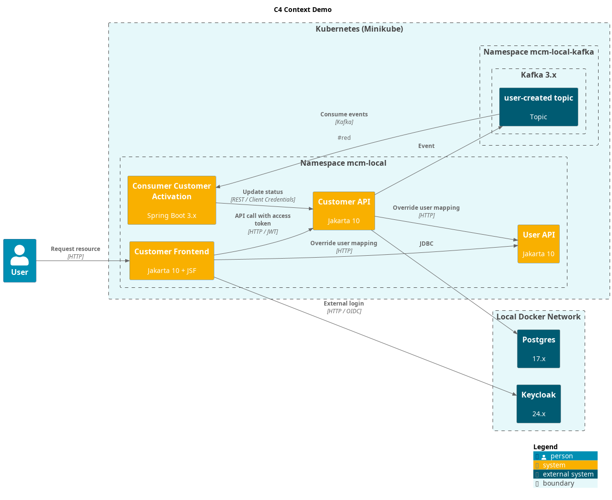
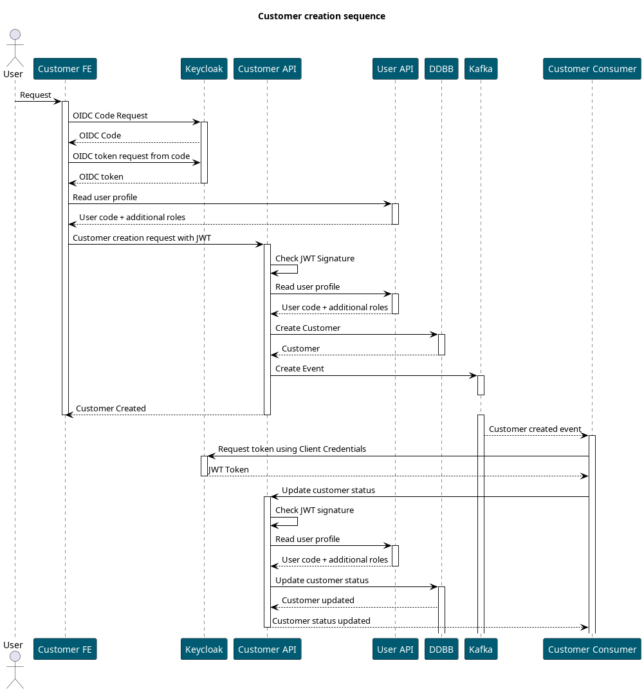
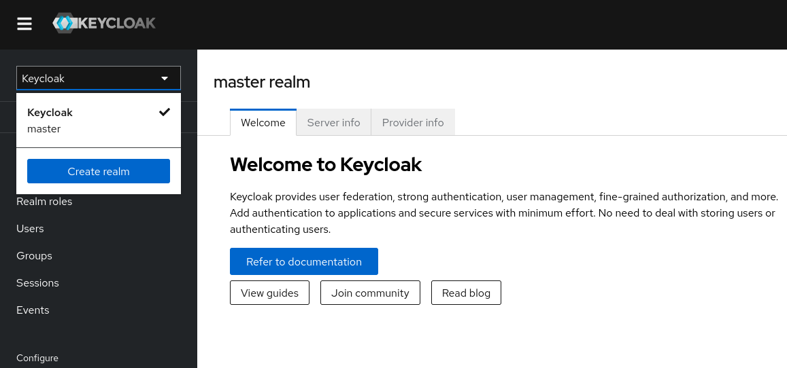
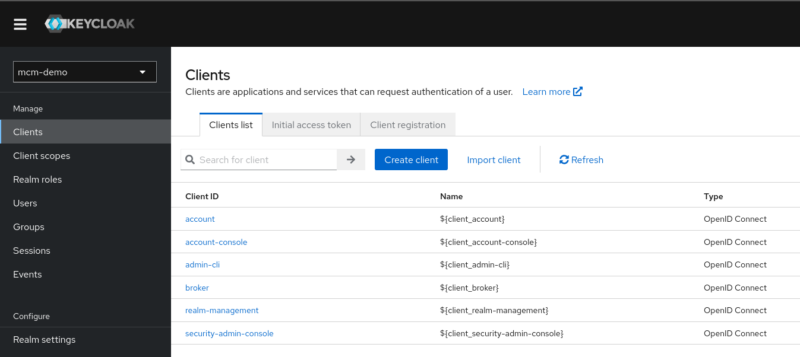
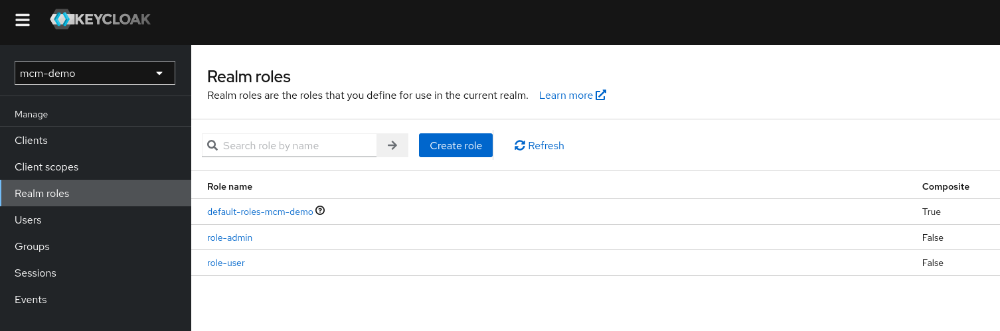
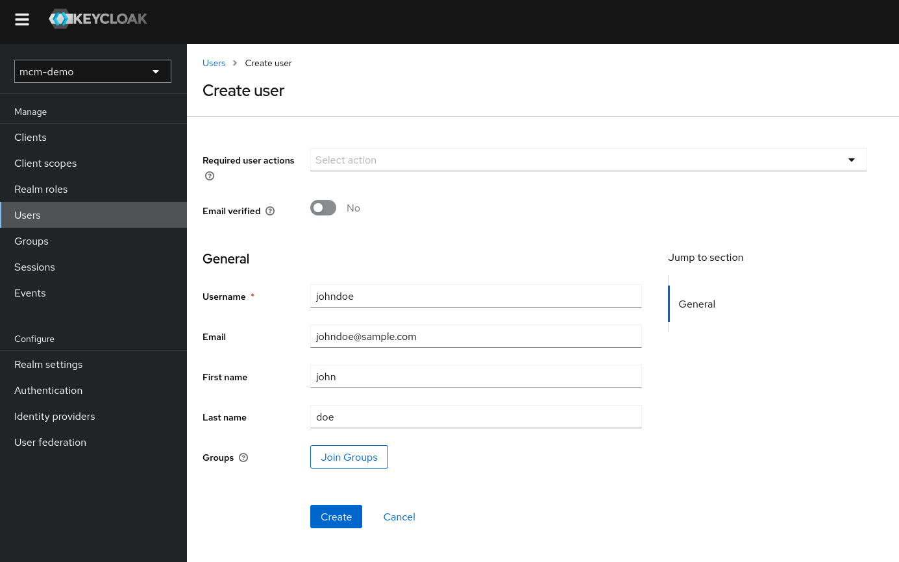
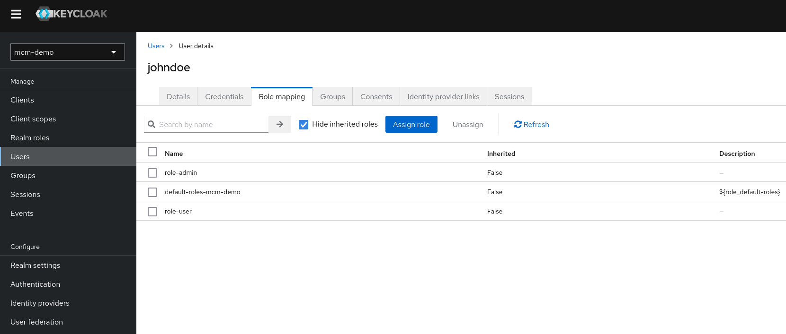
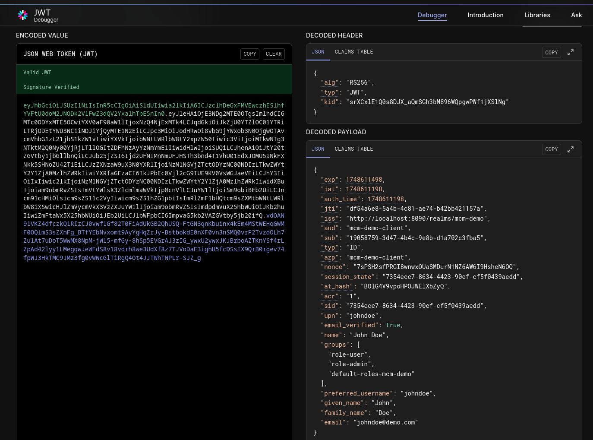

= MCM Demo Integración de Seguridad

== Objetivo

Este repositorio contiene diferentes ejemplos para la integración de la seguridad de
aplicaciones basadas en *Jakarta EE* y *Jakarta Security* a través de OAuth2 y
OpenID Connect.

En la demo utilizaremos *Keycloak 24.x* como IdP y *Wildfly 36.x* como servidor de aplicaciones compatible con Jakarta 10 y Jakarta
Security 3.x.

Utilizaremos una implementación ad-hoc basada en Jakarta Security de los flujos de seguridad para controlar la autenticación y
autorización sin utilizar los componentes específicos de cada servidor de aplicaciones de tal modo que la capa de seguridad esté
desacoplada de la implementación de servidor.

Proyectos:

* link:mcm-demo-lib-security-jwt[]: starter de seguridad para servicios REST basados en JWT basado en Jakarta Security.
* link:mcm-demo-lib-security-oidc[]: starter de seguridad para aplicaciones web basado en OIDC  basado en Jakarta Security.
* link:mcm-demo-lib-user-client[]: cliente de la API REST de usuarios utilizado para mapear los usuarios y roles obtenidos de Keycloak
  con valores obtenidos a través de un servicio.
* link:mcm-demo-api-customers[]: ejemplo de API REST Code-First con un CRUD básico de clientes.
* link:mcm-demo-api-users[]: ejemplo de API REST Contract-First con consultas de usuarios.
* link:mcm-demo-ui-jsf[]: frontal basado en JSF que consume la API de clientes y utiliza OIDC para la autenticación.
* link:mcm-demo-ui-angular[]: frontal basado en Angular que consume la API de clientes y utiliza OIDC para la autenticación.
* link:mcm-demo-ui-spring-boot[]: frontal basado en Spring Boot + Thymeleaf que consume la API de clientes y utiliza OIDC para la
  autenticación.
* link:mcm-demo-consumer-customers-activation[]: consumidor de eventos de activación de clientes a a través de Kafka basado en Spring Cloud Stream.

== Flujo de autenticación

En este caso durante la creación del cliente se notificará el evento de creación a una topic de Kafka que actualizará el estado a través de
la API de clientes utilizando Client Credentials para la autenticación.

== Implementación de la capa de seguridad

En esta demo se utilizan dos librerías de seguridad, una para la autenticación basada en OIDC utilizada en la aplicación web y otra para
la autenticación basada en JWT utilizada en la API REST.

Ambas librerías están basadas en Jakarta Security. En esta demo se utiliza la versión 3.0 de Jakarta Security aunque es compatible con
Jakarta Security 1.0 simplemente actualizando los nombres de paquetes de _javax.*_ a _jakarta.*_. 

La implementación está basada en la interface link:https://jakarta.ee/specifications/platform/8/apidocs/javax/security/enterprise/authentication/mechanism/http/httpauthenticationmechanism[HttpAuthenticationMechanism] de Jakarta:

[source, java]
----
@ApplicationScoped
public class CustomAuthenticationMechanism implements HttpAuthenticationMechanism {

    @Override
    public AuthenticationStatus validateRequest(
        HttpServletRequest request,
        HttpServletResponse response,
        HttpMessageContext context)
        throws AuthenticationException {
            // do some stuff
        }
}
----

En el caso de la librería OIDC en primer lugar comprobaremos la sesión para verificar si el usuario está autenticado. En caso de que no lo esté, redirigiremos al usuario a la página de login de Keycloak enviando
la URL de callback.
En el caso de recibir el callback realizaremos una consulta a Keycloak a partir del código recibido para
obtener el token de acceso y si este es válido crearemos la sesión del usuario.

En el caso de la librería JWT simplemente comprobaremos que este token viene correctamente informado en la
cabecera de la petición. Validaremos la firla del token a partir de la clave pública de Keycloak obtenida
desde el endpoint _/realms/mcm-demo/protocol/openid-connect/certs_ y si es válido establecereos el contexto
de seguridad con los roles obtenidos del token.

== Configuración local de Keycloak

Antes de arrancar los proyectos es necesario configurar el Realm, los clientes y los
usuarios. Crearemos tres usuarios de ejemplo con diferentes roles para probar la
correcta autorización de los servicios.

En primer lugar crearemos una red local de Docker para que los contenedores puedan comunicarse entre ellos. Para ello utilizaremos el comando:

[source, bash]
----
docker network create mcm-demo
----

Una vez creada la red arrancaremos el contenedor de Keycloak en el puerto 8090 con
el siguiente comando:

[source, bash]
----
docker run -d --name mcm-demo-keycloak --network mcm-demo -p 8090:8080 \
  -e KEYCLOAK_ADMIN=admin \
  -e KEYCLOAK_ADMIN_PASSWORD=admin \
  quay.io/keycloak/keycloak:24.0.3 \
  start-dev
----

Una vez arrancado el contenedor podemos acceder a la consola de administración de Keycloak
a través de la URL http://localhost:8090/ y autenticarnos con el usuario y contraseña
configurados al crear el contendor (_admin/admin_).

Desde la consola crearemos el Realm _mcm-demo_:

Una vez creado el Realm crearemos el cliente "johndoe"

Una vez creado el cliente crearemos dos grupos de ejemplo:

Después crearemos un usuario de ejemplo _johndoe@demo.com_:

Y le asignaremos los dos roles creados anteriormente:

De tal modo que en el token JWT podamos ver los roles asignados al usuario:

La configuración de los usuarios creados deberá ser la siguiente:

[options="header"]
|===
|Usuario            | Roles
|_customer-manager_ | _customer-manager_, _customer-viewer_
|_customer-viewer_  | _customer-viewer_
|_johndoe_          | _user_, _admin_ 
|===

== Instalación local de las librerías de seguridad

Dado que los otros proyectos dependen de las librerías de seguridad, es necesario instalarlas en el repositorio local de Maven.

Para ello simplemente deberemos hacer ejecutar el comando _./mvnw clean install_
en los proyectos:

* _mcm-demo-lib-security-jwt_
* _mcm-demo-lib-security-oidc_
* _mcm-demo-lib-user-client_

== Instalación local de Postgres

----
docker run -d \
  --name mcm-demo-postgres \
  --network mcm-demo \
  -e POSTGRES_USER=user \
  -e POSTGRES_PASSWORD=changeit \
  -e POSTGRES_DB=mcmdemo \
  -p 5432:5432 \
  postgres:latest
----

== API de Clientes

Este proyecto expone una API REST con el CRUD básico de la entidad _Customer_ guardando la información en una base de datos a través de JPA.

Para construir y arrancar en una imagen local el proyecto utilizaremos los comandos siguientes dentro del proyecto _mcm-demo-api-customers_:

----
./cmd-docker-create-image.sh
./cmd-docker-start.sh
----

El primero compila el proyecto y crea la imagen de Docker configurando
la seguridad del perfil _standalone-microprofile.xml_ de Wildfly.

El segundo comando arranca la imagen Docker con las variables de entorno necesarias para la conexión con Keycloak.

La información de la API se puede consultar a través del siguiente
link:mcm-demo-api-customers[link].

== Frontal JSF de clientes

Este proyecto consiste en un frontal básico basado en JSF que consume la
API de clientes y utiliza OIDC para la autenticación propagando el token
de acceso a la API.

Levantaremos el proyecto a través de Docker del mismo modo que la API de clientes:

----
./cmd-docker-create-image.sh
./cmd-docker-start.sh
----

El primer comando compila el proyecto y crea la imagen de Docker configurando
la seguridad del perfil _standalone.xml_ de Wildfly.

El segundo comando arranca la imagen Docker con las variables de entorno necesarias para la conexión con Keycloak y la API de clientes.

== TODO

En este ejemplo en primer lugar definiremos una API REST de ejemplo que implementa un CRUD de la entidad Customer y posteriormente dos frontends basados
tanto en JSF como en Spring Boot + Thymeleaf que se integran con dicha API.

// Para la autenticación utilizaremos el flujo Authorization Flow de OAuth2 a partir de una imagen local de Keycloak.

// * Pruebas integración Wildfly con el perfil standalone
// * Definición estructura DDD de paquetes
// * POC API Code-First
// * POC API Contract-First
// * Integración seguridad usando Jakarta EE usando Spring Security
// * Pruebas de integración de diferentes módulos de Spring Boot (data, cloud config, cloud stream, actuator, etc.)
// * Dockerizar y crear los manifest pasra desplegarla en k8s (minikube)
// * Integración seguridad OAuth2 con Authorization Code Flow
// * Gestion variables de configuración

== Arranque local de Wildfly

Para las pruebas se ha utilizado la versión 36.0.1 de Wildfly, que se puede descargar desde https://wildfly.org/downloads/

Utilizaremos una configuración preestablecida para de _standalone_ para el arranque en local en la que hemos añadidos los módulos de _MicroProfile_. Esta configuración
se encuentra en la carpeta _config_.

[source, bash]
----
./standalone.sh -c standalone-custom.xml
----

Una vez arrancado el servidor, podemos acceder a la consola de administración en:

http://localhost:9990/console

== Arranque local a través de Docker

=== Proyecto mcm-demo-api-customers-jakarta-code-first

Este proyecto está basado en Jakarta EE y define una API REST que implementa un CRUD de la entidad Customer.

En primer lugar arrancaremos la API ya que necesitaremos la definición OpenAPI de esta autogenerada a través de MicroProfile para construir el cliente de los frontends.

Para ello simplemente ejecutaremos el script _cmd-docker-screate-image.sh_ que construye el proyecto y crea la imagen local de Docker.

Podemos ejecutar la imagen a través del scripts _cmd-docker-start.sh_ que inicializa la red local de Docker y arranca la imagen.

Una vez arrancada la imagen comprobaremos que la API está correctamente desplegada consultando la definición de la API a través de:

[source, bash]
----
curl --location 'http://127.0.0.1:8081/openapi'
----

Verificaremos que la API funciona obteniendo el listado de clientes que al no haber creado ninguno no debería devolver resultados:

[source, bash]
----
curl --location 'http://127.0.0.1:8081/demo-api/api/customers'
----

Este servicio deberá devolver:

[source, json]
----
{
    "content": [],
    "page": 0,
    "size": 10,
    "totalElements": 0,
    "totalPages": 0
}
----

La imagen docker de este proyecto ejecuta el perfil standalone-microprofile.xml de Wildfly ya que incluye los módulos que utilizaremos para generar
dinámicamente la definición OpenAPI usando Code-First.

=== mcm-demo-ui-jsf

Este proyecto define un CRUD básico de clientes utilizando la API de consulta definida en el proyecto anterior. Durante la construcción del proyecto crea
las clases del cliente a partir de la URL de nuestro servicio de modo que es necesario que esté en ejecución para compilar el proyecto.

[source, xml]
----
<plugin>
    <groupId>org.openapitools</groupId>
    <artifactId>openapi-generator-maven-plugin</artifactId>
    <version>7.12.0</version>
    <executions>
        <execution>
            <id>generate-rest-client</id>
            <goals>
                <goal>generate</goal>
            </goals>
            <configuration>
                <inputSpec>http://127.0.0.1:8081/openapi</inputSpec>
                <... />
        </execution>
    </executions>
</plugin>
----

La imagen docker de este proyecto ejecuta el perfil standalone.xml de Wildfly ya que es el que incluye los módulos de JSF utilizados por la interface web.

=== mcm-demo-ui-spring-boot-oauth2

Este proyecto define un CRUD básico de clientes utilizando la API utilizando Thymeleaf y Spring Boot en lugar de Jakarta EE y JSF.

== Estructura de paquetes

- *domain*: entidades del dominio (no las entidades JPA) y servicios con la lógica del negocio.º

- *application*: clases de aplicación que implementan la lógica del negocio y delegan en los servicios del dominio. Estas clases no deberían tener mucha lógica, sino que deberían delegar en los servicios del dominio.

- *infrastructure*: clases de infraestructura que implementan la lógica de acceso a datos, como repositorios, adaptadores y servicios externos.

== Ejecutando el proyecto con Minikube

En primer lugar crearemos un clúster de Minikube con Docker como driver:

[source, bash]
----
minikube start --driver=docker
----

Después iniciaremos la consola de administración de Minikube:

[source, bash]
----
 minikube dashboard
----

[source, bash]
----
minikube stop
----

== Recursos

Prueba de lectura del token a través del grant type password para verificar la configuración del usuario:

[source, bash]
----
curl -X POST \
  -d "grant_type=password" \
  -d "client_id=mcm-demo-client-jsf" \
  -d "client_secret=HtsCdaR7o5KoNQpI0BOOWwtds1sxorCT" \
  -d "username=johndoe" \
  -d "password=changeit" \
  "http://localhost:8090/realms/mcm-demo/protocol/openid-connect/token"
----

== Puertos locales

|===
|_mcm-demo-api-customers_              | 8081
|_mcm-demo-api-users_                  | 8082
|_mcm-demo-keycloak_                   | 8090
|===

// https://github.com/wildfly/wildfly-s2i/tree/main/examples/jsf-ejb-jpa/src/main/java/org/wildfly/plugins/demo/jsf

// https://medium.com/@iaravinda33/integrating-keycloak-authentication-with-spring-boot-a-complete-guide-98df2c8d244a

// https://ralph.blog.imixs.com/2025/03/26/wildfly-29-oidc-bearer-token-authentication/
