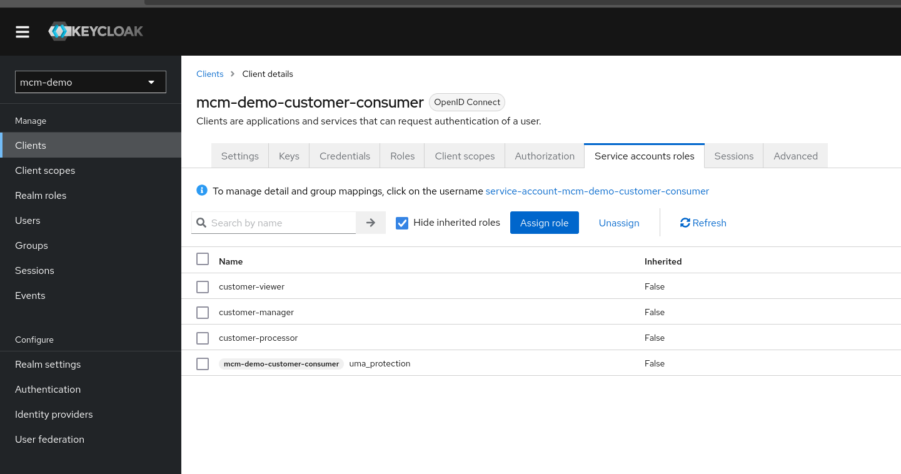

= mcm-demo-consumer-customer-activation

Este componente recive los eventos a través de Kafka de la creación de los clientes y los procesa
para actualizar el estado a través de una llamada a la API de clientes usando el tipo de
autenticación Client Credentials.

Para ello deberemos crear en Keycloak el cliente llamado _mem-demo-customer-activation_ con los roles:

* _customer-viewer_
* _customer-manager_
* _customer-processor_

Este último rol es el que permite la actualización del estado del cliente a través de la API.

TIP: hay que tener en cuenta que en este caso los roles están definidos a nivel del cliente a diferencia
de los roles de los usuarios.

Aplicación basada en Spring Boot que consume eventos de creación de clientes a través de Kafka.

El binding del topic lo realizaremos a través de Spring Cloud Stream a partir de la siguiente configuración:

[source, yaml]
----
spring:
  cloud:
    stream:
      bindings:
        customerCreated-in-0:
          destination: ${APP_KAFKA_TOPIC_CUSTOMER_CREATED}
      kafka:
        binder:
          brokers: ${APP_KAFKA_BROKER}
          configuration:
            security.protocol: SASL_PLAINTEXT
            sasl.mechanism: PLAIN
            sasl.jaas.config: >
              org.apache.kafka.common.security.plain.PlainLoginModule required
              username="${APP_KAFKA_USERNAME:user1}"
              password="${APP_KAFKA_PASSWORD:879P1qgPkc}";
----

Podemos probar la aplicación utilizando _kcat_:

Enviar un mensaje al topic:

[source, bash]
----
echo "foo" | kcat \
  -b 192.168.49.2:31108 \
  -X security.protocol=SASL_PLAINTEXT \
  -X sasl.mechanisms=PLAIN \
  -X sasl.username=user1 \
  -X sasl.password=879P1qgPkc \
  -t customers-created-topic \
  -P
----

Escuchar los mensajes del topic:

[source, bash]
----
kcat \
  -b 192.168.49.2:30627 \
  -X security.protocol=SASL_PLAINTEXT \
  -X sasl.mechanisms=PLAIN \
  -X sasl.username=user1 \
  -X sasl.password=teVM3iV3V8 \
  -t customers-created-topic \
  -C
----