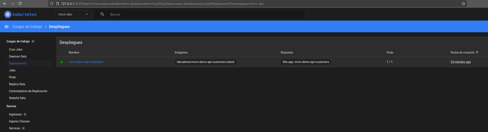

= Minikube

Este documento describe como desplegar la demo en un entorno local de Minikube.

En primer lugar iniciaremos Minikube a través del comando:

[source,bash]
----
./cmd-minikube-start.sh
----

Este comando creará el namespace `mcm-dev`, habilitará el addon de Ingress y creará el ConfigMap y Secret necesarios para la demo.

Una vez arrancado desplegaremos los recursos con:

[source,bash]
----
./cmd-minikube-deploy.sh
----

Este comando realizara el `kubectl apply` de los recursos necesarios para la demo.

Una vez desplegados los recursos, podremos acceder al dashboard ejecutando:

[source,bash]
----
minikube dashboard
----

Esto abrirá una nueva pestaña en el navegador con el dashboard de Minikube. En el selector de namespace seleccionaremos `mcm-dev` para ver los recursos desplegados en este namespace.

Una vez desplegados los recurso necesitaremos configurar en el _/etc/hosts_ los nombres de los
servicios locales. Para ello añadiremos las siguiente entradas:

----
192.168.49.2 mcm-demo-api-customers.local
192.168.49.4 mcm-demo-ui-jsf.local
----

Siendo _192.168.49.4_ la dirección IP resuelta por el comando `minikube ip`.

Para esta demo no hará falta instalar Keycloak en Minikube ya que podremos utilizar la imagen Docker
en local y que nuestros servicios se conecten a ella a través del host _host.minikube.internal_.

Por ejemplo, para la configuración del almacén de claves en nuestros servicios indicaremos:

----
JWK_URI: http://host.minikube.internal:8090/realms/mcm-demo/protocol/openid-connect/certs
----

Y desde los pods se podrá acceder al servicio de Keycloak local.

== Consultas

Consulta de clientes

https://mcm-demo-api-customers.local/api-customers/api/customers

== Comandos

=== Listado de servicios

----
kubectl get service -n mcm-dev
----

=== Comprobación del servicio de la API de clientes

----
kubectl run -it --rm --image=busybox --restart=Never test --namespace mcm-dev -- wget -qO- http://mcm-demo-api-customers:80/openapi
----
